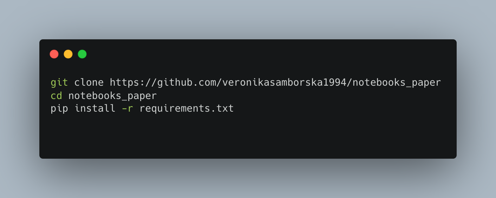

# Code for simulating RNN and generating plots in "Complementary task representations in hippocampus and prefrontal cortex for generalizing the structure of problems.(2022) Nature Neuroscience"

## RNN set up:
- current data method:
    - feed in 4 timesteps at a time to RNN: reward, ITI, init, choice
    - reward is computed using RNN choice from previous timestep
    - RNN outputs actions: do nothing, do nothing, port, port
    - targets are the perfect actions (no bayesian yet)
    - gets accuracy on each step: 1.0, 1.0, 1.0, 0.5
    - for final step (choice, just picks same port regardless of reversals)

- do I need to change the data method?
    - alternative is to compute behaviour offline using ideal bayesian agent

- make sure feedfwd input ~ recurrent input, can scale initialisation of fwd pathway
- hold out some layouts? yes, do train test error
- param norms, diff losses, act norms

> This repository contains Jupyter Notebooks and .py code for replicating figures in our paper. Behavioural and neural data needs to be downloaded from [here](https://doi.org/10.6084/m9.figshare.19773334) 

## Installation

## Summary

After downloading the data, cloning the github repository and installing a few basic python packages in the requirements.txt file (above) you should be able to easily run all of the code in Jupyter Notebook

**behaviour.ipynb** will plot all the figures that relate to behavioural results in our paper (both in main and extended Data)

**cells - main figures.ipynb** will plot all the **main figures** that relate to neural results in our paper 

**cells - extended data.ipynb** will plot all the **extended data figures** that relate to neural results in our paper 
 

